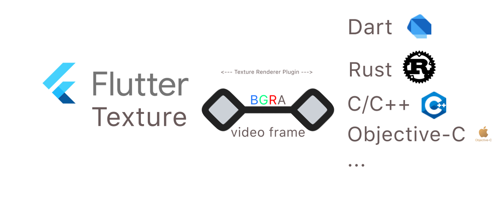

# Texture Rgba Renderer 

A general texture helper which brings both of high and low level api to handle **BGRA** data for Flutter. Only one time frame copy required, and aims to get a full hardware acceleration.

This plugin is originally developed for [RustDesk](https://github.com/rustdesk/rustdesk).

Now it's in active development, which aims to improve the memory usage and performance. 




[](https://app.fossa.com/projects/git%2Bgithub.com%2FKingtous%2Fflutter_texture_rgba_renderer?ref=badge_shield)

## Platform Support

The plugin aims to provide opengl impl for the texture, which bring a better performance instead of `FFI` + `CustomPainter`.

- [x] Linux
- [x] Windows
- [x] MacOS

Note: Please use the `BGRA` format for ALL platforms.

## Getting Started

### Create a texture by calling `createTexture`.

```dart
_textureRgbaRendererPlugin.createTexture(key).then((textureId) {
      if (textureId != -1) {
        debugPrint("Texture register success, textureId=$textureId");
        setState(() {
          this.textureId = textureId;
        });
      } else {
        return;
      }
    });
```

### Transfer rgba data by calling `onRgba`.

```dart
data = mockPicture(width, height);
final res = await _textureRgbaRendererPlugin.onRgba(key, data!, height, width);
if (!res) {
    debugPrint("WARN: render failed");
}
```

### Close a texture by calling `closeTexture`.
```dart
if (key != -1) {
    _textureRgbaRendererPlugin.closeTexture(key);
}
```

Check the example for details.

## API

For a better convienent interface for both dart and native developers, the plugin provides two kinds of APi to render the frame.

Benchmark:

macOS Bigsur qemu vm (4+8G), with OpenGL accelerated. Release build.

| API Kind | FPS(Average) | 
|----|-----|
| Method Channel (Dart) API | ~45 |
| Native API | ~**670** |

Conclusion:

For a better performance, please use `Native` API provided by this plugin.

### Dart API

You can create/close a texure with the dart API provided by this plugin. And you can also provide the BGRA data to the texure via `onRgba` function.

```dart
class TextureRgbaRenderer {

  /// Create a texture with unique identifier [key].
  /// 
  /// @return a texture id which can be used with
  /// ```dart
  /// Texture(textureId: textureId)
  /// ```
  Future<int> createTexture(int key) {
    return TextureRgbaRendererPlatform.instance.createTexture(key); 
  }

  /// Close a texture with unique identifier [key].
  /// 
  /// @return a boolean to indicate whether the operation is sucessfully executed.
  Future<bool> closeTexture(int key) {
    return TextureRgbaRendererPlatform.instance.closeTexture(key); 
  }

  /// Provide the rgba data to the texture.
  Future<bool> onRgba(int key, Uint8List data, int height, int width) {
     return TextureRgbaRendererPlatform.instance.onRgba(key, data, height, width); 
  }

  /// For native API.
  Future<int> getTexturePtr(int key) async {
    final ptr =
        await methodChannel.invokeMethod('getTexturePtr', {"key": key}) ??
            false;
    return ptr;
  }
}
```

## Native API

Note that the `onRgba` function is not called immediately. It depends on the execution scheduler of Flutter. To solve the problem, the plugin provide the low level function on all 3 pc platforms, which can make them be executed immediately.

```c
void FlutterRgbaRendererPluginOnRgba(void* texture_rgba_ptr, const uint8_t* buffer, int len, int width, int height, int row_align_bytes)
```

You could use the native API in other programing languages. A dart quick example:

```dart
/// The `Native` class is bundled in this plugin.
typedef F1 = Void Function(Pointer<Void> ptr, Pointer<Uint8> buffer, Int len,
    Int32 width, Int32 height, Int row_align_bytes);
typedef F1Dart = void Function(Pointer<Void> ptr, Pointer<Uint8> buffer,
    int len, int width, int height, int row_align_bytes);

class Native {
  Native._();

  static Native get _instance => Native._()..init();
  static Native get instance => _instance;

  late F1Dart onRgba;

  init() {
    final lib = DynamicLibrary.process();
    onRgba = lib.lookupFunction<F1, F1Dart>("FlutterRgbaRendererPluginOnRgba");
  }
}
...

// Call
Native.instance.onRgba(ptr_from_method_getTexturePtr, bgra_data, width, height);
```

Note that the `buffer` is not taken by the plugin, you should handle the lifecycle of the `buffer` yourself.

Both example usages of two kinds of `onRgba` can be found in `example` folder.

## Thanks

- [Flutter](https://github.com/flutter/flutter)
- [Flutter Engine](https://github.com/flutter/engine)
- [Dart VLC](https://github.com/alexmercerind/dart_vlc) 

## License
[](https://app.fossa.com/projects/git%2Bgithub.com%2FKingtous%2Fflutter_texture_rgba_renderer?ref=badge_large)